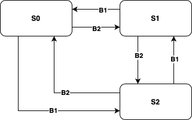

# Lab 1 - State Machines

Welcome to lab 1! This lab will introduce you to the hardware we use and to the C/C++ SDK provided by Rasbperry Pi for the Pico board. 

## Requirements 

For this lab you will need the **Maker Pi Pico** board that is part of your **lab kit**.
In addition, you will need the SDK and an ARM development toolchain. You have three different options there:

- Use preinstalled VM on one of the lab computers
- Install Raspberry Pi VS Code Extension
- Install the toolchain on your own machine

The preinstalled VM has all the software necessary for all the labs.
If you want to use your computer, the easiest and recommended option is installing the Visual Studio Code (**VSCode**), which you will likely want to use for development, and in it, the Raspberry Pi VS Code Extension.
Installing this extension will automatically install all required software, and provide a convenient development environment from within **VSCode**.
For installation instructions follow the guidelines in [Getting started with Raspberry Pi Pico](https://datasheets.raspberrypi.com/pico/getting-started-with-pico.pdf).
Linux users will want to update `udev` rules by adding [this file](https://gist.githubusercontent.com/tjvr/3c406bddfe9ae0a3860a3a5e6b381a93/raw/78873b8f590540dd0771eeec61675a4af63c1685/99-pico.rules) to permit flushing to the device without sudo.
Alternatively, you can manually install the toolchain on your machine.
How to do so is described in a previous version of the "Getting started with Raspberry Pi Pico" document which is included in the `docs` folder.

If you want to use your own computer, you may also wish to install **VSCode** for development, and **OpenOCD** for debugging (automatically installed with the extension).
To compile/run from within **VSCode**, you have to supply it with appropriate configuration files stored in the `.vscode/` directory of the project.
The extension adds such files automatically when you create a new project.
The template contains such files in case you don't want to use the extension.

**If you use your own machine and the compilation from the terminal fails, doublecheck that you have set the `PICO_SDK_PATH` environment variable!**

<div style="page-break-after: always;"></div>

## Template 

To get you started, download the template for lab 1 from Studium!
Look through the code and try to understand it.
The template contains all the files necessary to build from terminal.
If you use the extension, the only file you need is `main.c`, since the others are automatically generated when you create a new project. 
Create a new C/C++ Project, with Board Type "Pico", name "lab1" and copy the contents of `main.c` to the newly created `lab1.c`.
Notice that your project already contains a `CMakeLists.txt` and `pico_sdk_import.cmake` which are used to build your project.
You can now do the development in `lab1.c`.
If you don't use the extension, you can use the supplied `CMakeLists.txt` and `pico_sdk_import.cmake` files and develop directly in `main.c`.

**You may use some of the code you have already seen during the lecture! It is located under Files/Code on Studium!** 

## Debugging 

If you want to step through your code, you can connect your board to a debugger.
For this you will need the second Pico board that is part of your lab kit.
You can find the wiring diagram and setup in [Getting started with Raspberry Pi Pico](https://datasheets.raspberrypi.com/pico/getting-started-with-pico.pdf) in Appendix A.
The extension provides **VSCode** debugging features out-of-the-box. 
If you don't use the extension, you can enable these features by using the configuration files included in the template.

## Goal 

At the end of this lab you will have implemented a state machine with various states, each of which is determined by a different light pattern shown through the LEDs on the development board. State changes are triggered by button presses. The overall state machine is illustrated below:

 

As can be seen, there are three different states. The first and second button on the board (GP20, GP21) are used to switch between these states in a clockwise (respectively counter clockwise) manner. The different states are defined as follows:

When the system is in state **S0** it will display a light rope on the first 4 LEDs (GP0 - GP3), i.e. LED1 will light up, after a short while it will turn off and LED2 will turn on, etc. In **S1** all LEDs will turn on for a while, and then all will turn off, this behaviour is repeated (i.e. you will blink all LEDs). **S2** is the same as **S0**, but in the other direction and faster.


## Part 1 

If you inspect the code, you will find that in the beginning we define some custom types, which we will use for our application. In part 1 of this lab we will only deal with the first state, **S0**. If we look at the type specification for a state

```C 
typedef void (*state_func_t)( void );

typedef struct _state_t
{
    uint8_t id;
    state_func_t Enter;
    state_func_t Do;
    state_func_t Exit;
    uint32_t delay_ms;
} state_t;
```
we can see, that each state has an ID, three different fuctions that are called when entering, executing, and exiting the state, and a delay, which will determine how often we check for a button input. To make it easier for you, in the template we have already provided you with the function signature for the executing state function (`void do_state_0( void )`), and also included parts of the execution routine in the main function. As a first step, implement the three different functions for the first state. When you have implemented your state functions, fill out the `const state_t state0` declaration given further down in the file.

Think of a good value for the delay, so that you can clearly see the light rope (also consider that when implementing **S2**, you will need to make that one faster, so you should give yourself some margin here). When you have implemented the `state0` variable, you can turn to the main function, and finish it in a very basic implementation that calls the appropriate state functions at appropriate times.

<div style="page-break-after: always;"></div>

### Compile and upload 
If you use the extension, you can compile by double-clicking on "Compile Project" on the side panel.
Otherwise, from the terminal, you can compile your code by issuing


```bash
mkdir build
cd build
cmake ..
make
```

Once your program has compiled, you can upload it to your connected board by copying the generated binary (located in `build`) onto the USB device.
With the extension, this can be done by double-clicking on "Run Program".
To be able to upload the binary, the board should be in BOOTSEL mode.
You can activate this mode by keeping BOOTSEL button pressed while connecting the board.

Hints: **The implementation of the Do function must not use any form of delay or loop!**

## Part 2 

For this part you will implement the other two states and also the state changing mechanism. For this, start by implementing the state functions, and also the state declarations according to how you've done it in the first part. Once you are finished, fill out the state table `const state_t state_table[][]` in the code. Observe, that you need to include a possible transition for each event type that you have defined, even if in your current state, you do not adhere to certain inputs. In those cases, the state should remain the same, i.e. you can put the current state in those columns (one such case is for the no_evt, which signals that no input was received).

Now that you have implemented the states, you also need to implement the state transitions. For this, implement button debouncing as seen during the lecture. The communication between your button event handler and your main function can be done in different ways. We suggest to use the queue library of the SDK as seen during the lecture. Make sure to use a proper button debounce delay! For better readability you can also implement a function `event_t get_event(void)` that looks if there is a new data element in the queue and returns the appropriate event. This function can then be used in the main function to determine if a state change needs to happen. 
You will also have to update the execution mechanism in the main function. For reference, you might want to consult the lecture slides about the traffic lights example again. 

<div style="page-break-after: always;"></div>

## Part 3

By now you have a functioning state machine, which allows you to switch between different light patterns by pressing the first and second button on your board. Maybe you think, that implementing the state machine in the table driven way was a bit of an overkill for this example, and you are right, this could have also been done in a different (probably easier) way. However, to see why table driven implementations are quite powerful, we will now introduce a new state **S3**. This state is entered whenever you are in any of the other states, and press button 3. In this state, the first LED will slowly fade between full brightness and being turned off. Upon any button press it shall continue with state **S0**. To implement this, you will need to make use of the pwm library. 

Hints: You may have to include something in CMakeLists.txt for this! 

**When you are finished with all parts show the solution to one of the teachers! Once we have approved it you also have to upload it to Studium!** 

If you are done with all the mandatory parts (well done BTW!), here are some optional things to try.

<ol>
<li> Debug your code (see Debugging section)! You can use the setup for debugging also to program the device without having to disconnect/connect it from the USB port!</li>
<li> Use `printf` statements and view the printed output in a console/terminal.
For this you will need a terminal program, such as minicom, screen, or Putty. </li>
<li> Build everything from the terminal without using the **VSCode** extension.
This will come in handy next lab when we will no longer use Pico SDK, but Zephyr.</li>
</ol>